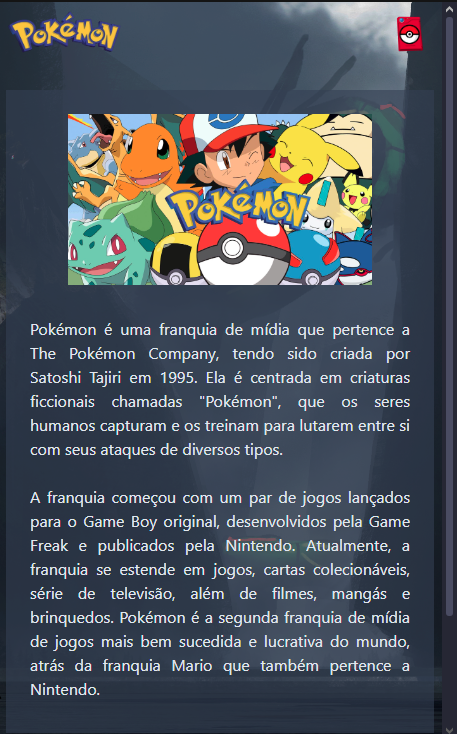
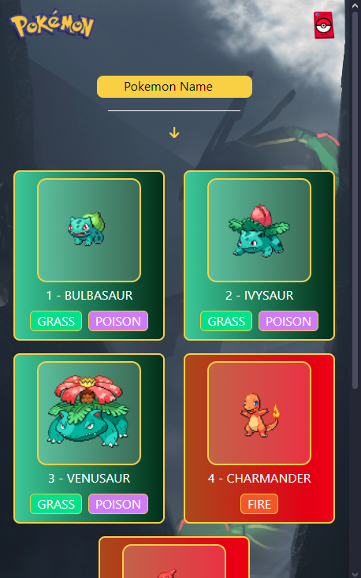
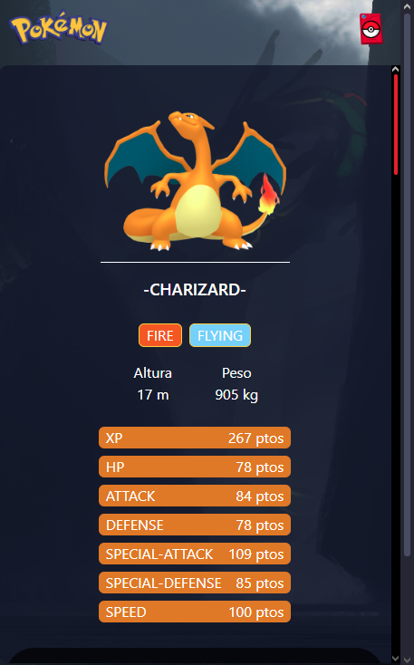
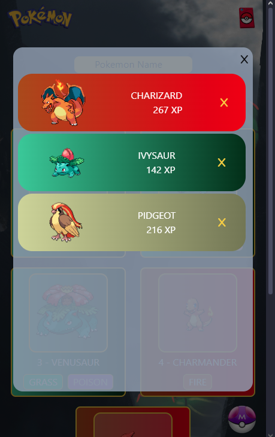

# Pokédex
- O objetivo desse projeto é realizar o desafio técnico final do módulo de React do curso DevQuest.
- Criei 3 páginas:
  - Home - Com uma apresentação simples do que é Pokémon.
  - Pokedex - Onde apresento um input para filtragem por nome, os cards de apresentação dos pokemons.
  - Perfil do pokemon - Onde apresento suas informações.

## Tecnologias
- HTML
- CSS
- JS
- React
- Tailwind
- React-Rounter-Dom
- Redux
- Axios
- API do Pokémon

## Desafios e Soluções
#### Configuração do Axios com Redux
- Se utilizando de uma hook personalizada, passo o numero de pokemons que quero buscar(1025), e recebo de volta um array com os dados!
- E usando dispatch, mando esse valor para um array no store, com um valor inicial pré definido.
#### Configuração do filtro de Name e type com Redux
- Antes de apresentar os pokeCards, passo por uma function que verifica se ela é filtrada, senão irá apresentar todos.
- Para a filtragem do type: Eu filtro os types depois mapeio os dois tipos, se tiver. Em seguida mapeio o novo array e apresento só os desse tipo.
- Para a filtragem do name: No input, mando os valores inseridos com dispatch para o store do redux, de lá faço o processo semelhante ao d type mas vendo se possui os valores inseridos no input. E em seguida apresento os pokemons que tem as letras, ou o pokemon do nome exato em si.
#### Configuração do Time Pokémon Redux
- Na apresentação de cada Pokemon, inseri um button, onde ao ser clicado esse pokemon em específico será adicionado ao array pre definido no redux.
- E quando um já for adicionado, aparecerá uma masterball na tela da pokedex.
- Dentro da lógica do slice, coloquei uma condicional, onde se o pokemon já estiver no time não será adicionado, e se no time já tiver 6 pokemons também não se poderá adicioná-lo.
- Por último posso excluir qualque pokemon do time, e quando o último for excluído a masterball não irá aparecer mais.
#### Estilização dos PokeCards
- Para a estilização dos cards, coloquei em cada card um id com seu tipo primário.
- E se usando da interpolação do react junto os valores do tailwindo mais o linear gradient pre definidos em uma função. Onde passará o valor correspondente ao do type do pokemon.
- Faço o mesmo conceito para o card no time pokémon.
#### Apresentação dos pokemons
- Desenvolvi uma lógica onde recebo valores pré definidos como props e apresento 2 buttons, um para avançar e ver mais pokemons e outro para voltar aos anteriores.
- Nessa lógica a divide em 2 partes, uma para os pokemons em geral + filtrados por nome, e outra para os filtrados por tipo.
- A lógica "mais complexa" foi a dos filtrados por tipo, onde tive que setar os valores de quantidade de cada um, para assim poder bloquear o button de avançar.

## Imagens do Projeto Final
 
 
 
